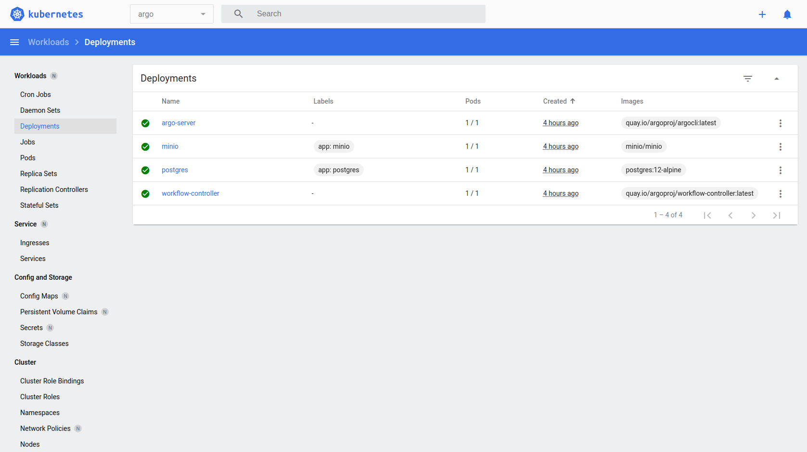
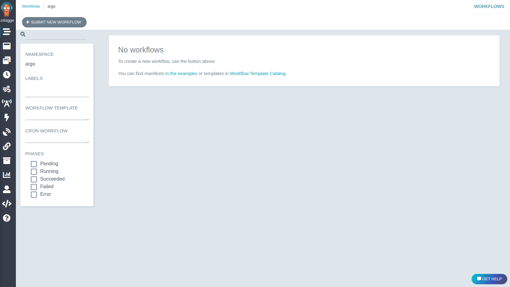
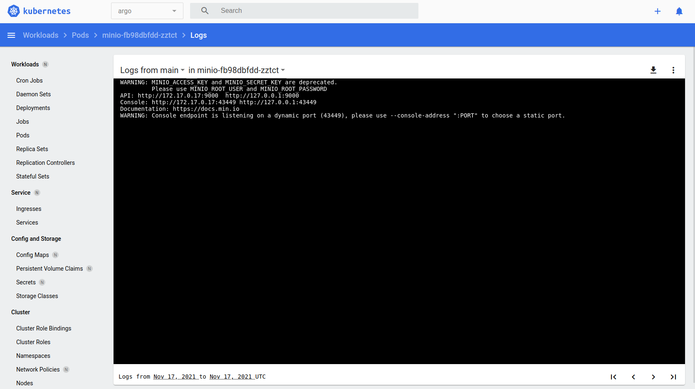
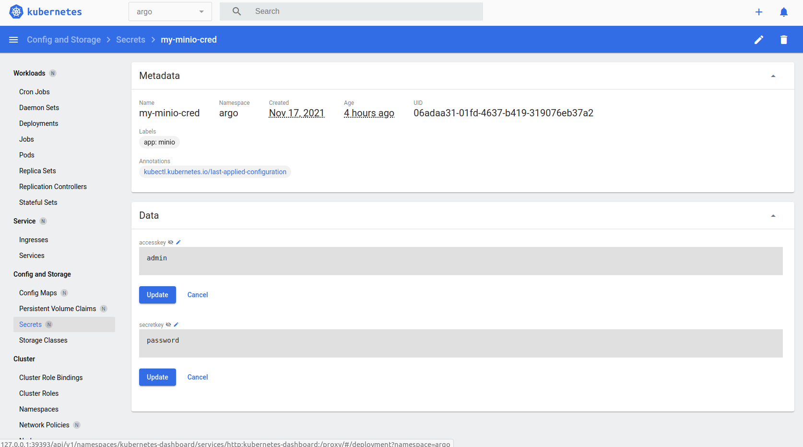
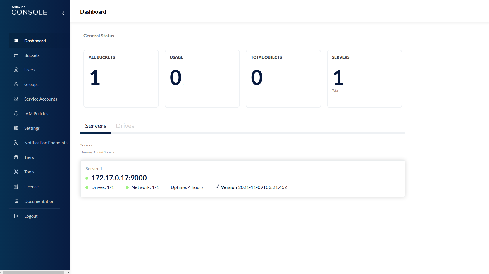
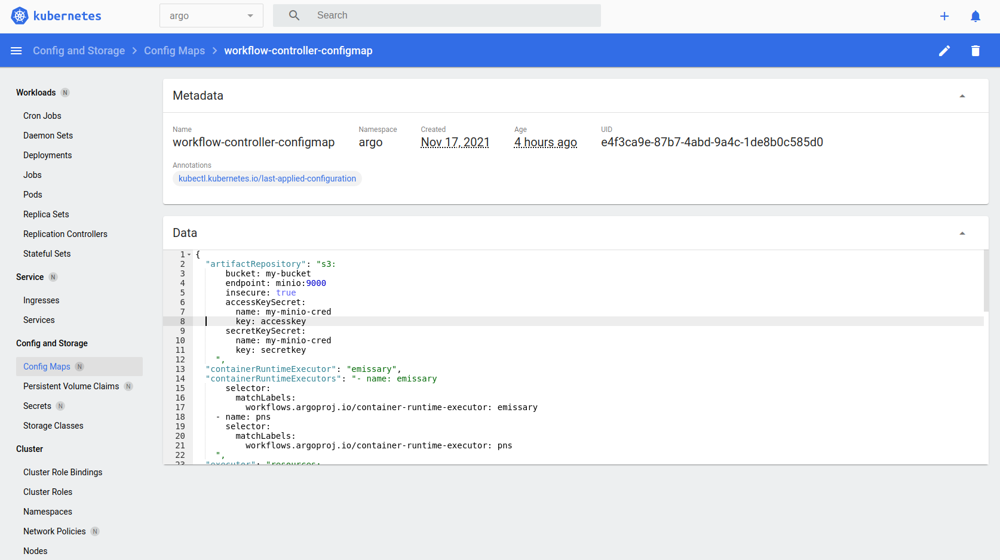

# Description
Argo Workflow PoC based on Python templates

# Install and start Minikube

```shell
curl -LO https://storage.googleapis.com/minikube/releases/latest/minikube-linux-amd64
sudo install minikube-linux-amd64 /usr/local/bin/minikube

minikube start
```

# Install Kubernetes CLI

```shell
curl -LO "https://dl.k8s.io/release/$(curl -L -s https://dl.k8s.io/release/stable.txt)/bin/linux/amd64/kubectl"
sudo install -o root -g root -m 0755 kubectl /usr/local/bin/kubectl

kubectl version --client
```

# Install Argo Workflow in Kubernetes

```shell
kubectl create ns argo
kubectl apply -n argo -f https://raw.githubusercontent.com/argoproj/argo-workflows/master/manifests/quick-start-postgres.yaml
```



# Install Argo Workflow CLI

From Argo WorkFlow Dashboard we could download the CLI


The install binary

```shell
curl -sLO https://github.com/argoproj/argo-workflows/releases/download/v3.2.4/argo-linux-amd64.gz

gunzip argo-linux-amd64.gz

chmod +x argo-linux-amd64

mv ./argo-linux-amd64 /usr/local/bin/argo

argo version
```

chmod +z 
# Access to Argo Workflow dashboard

Make a port-fordward of the argo-server port like this

```shell
kubectl -n argo port-forward deployment/argo-server 2746:2746
```

Open Argo Workflow dashboard Uri:

```shell
http://localhost:2746
```



# Access to Minio artifact repository

We could get open ports of Minio from Pod logs:

- Port 9000 is the Minio API Port
- Port 43449 is the Minio Console or Dashboard



Make a port-fordward of the minio console and API Minio published ports

```shell
kubectl -n argo port-forward deployment/minio 9000:43449
kubectl -n argo port-forward deployment/minio 9001:9000
```

Get Minio default credentials from Argo Workflow Minio secrets



Open Minio Dashboard

```shell
http://localhost:9000
```



# Argo Workflow artifact repository configuration

By default Argo Workflow used a S3 repository like artifact repository and the configuration is saved on the kubernetes config map called workflow-controller-configmap in the attribute called artifactRepository like this

